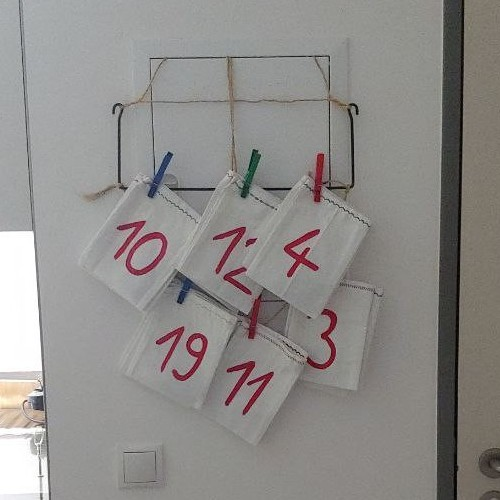

# Math Puzzle Advent Calendar
A set of 24 college-level puzzles about math, algorithms, computer science and hardware. I made this for my best friend at the end of our studies, but it should be accessible to anyone with a technical background.

# How it works
- Each puzzle's solution is a number between 1-24
- Each solution corresponds to a numbered sachet or other numbered container
- The number on the sachet is different from the date of the corresponding puzzle
- Each sachet contains an item for the correct date (a mapping is provided but should not be seen by the user or puzzle-solver)

### The host (or puzzle-giver)
- Prepare sachets with items for each day
- Starting on December 1st, send the user or puzzle-solver only the puzzle of the day
- Wait for them to solve it
- Check result and whether it's correct (optional if all items inside sachets already indicate intended date)

### The user (or puzzle-solver)
- Receive daily new puzzle
- Solve it
- Send result to host (optional if all items inside sachets already indicate intended date)
- Enjoy the item of the day!

# License
Licensed under CC BY-NC 4.0
https://creativecommons.org/licenses/by-nc/4.0/
